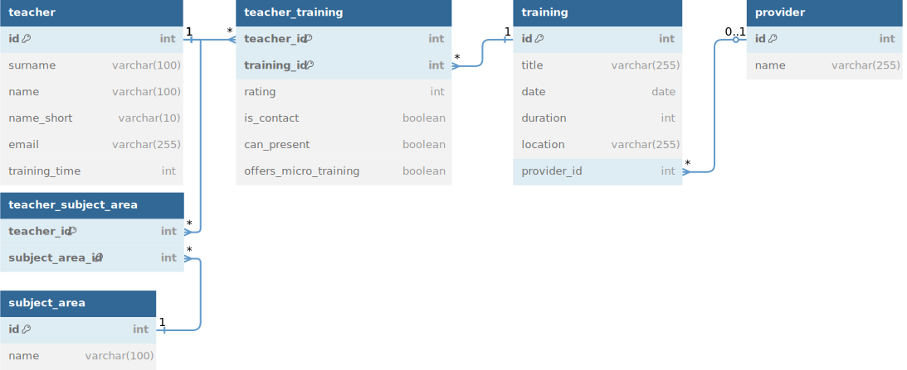

# 📚 ALO Fortbildungsdatenbank

Dieses Projekt dokumentiert eine webbasierte Datenbankanwendung zur Erfassung und Auswertung von Fortbildungsveranstaltungen, die von den Kolleginnen und Kollegen der ALO besucht wurden. Das Projekt entstand im Rahmen eines Schülerprojekts im IT-Bereich.

---

## 🎯 Zielsetzung

Ziel der Fortbildungsdatenbank ist es, folgende Anforderungen der ALO zu erfüllen:

- **Transparenz und Information:** Übersicht aller besuchten Veranstaltungen für KuK, FL, FBL und SL
- **Multiplikation:** Unterstützung der Weitergabe von Fortbildungsinhalten in den Schulalltag
- **Eigenbeleg:** Nachweis von mindestens 600 Minuten Fortbildung gegenüber der Schulleitung
- **Evaluation:** Vergleich von Fortbildungsbedarf (Plan) und tatsächlich besuchten Veranstaltungen
- **Qualitätsbewertung:** Möglichkeit der Sternebewertung von Veranstaltungen

---

## 🗃️ Datenmodell (ERD)



> Das vollständige Datenmodell befindet sich in [`docs/alo_training_data_model.dbml`](docs/alo_training_data_model.dbml) und kann über [dbdiagram.io](https://dbdiagram.io/d/Fobidb-67f8f9df4f7afba1843d5bb1) bearbeitet werden.

---

## 📋 Erfasste Daten

### 🖊️ Eingabefelder
- Name der Lehrkraft
- Titel der Veranstaltung
- Dauer (in Minuten)
- Anbieter (FoBi Berlin, FoBizz, ZAS, LISUM, Sonstige)
- Fachbereich (gemäß Fortbildungsplan)

### ✅ Anklickfelder (Checkboxen)
- Ansprechpartner für Rückfragen (ja/nein)
- Vorstellung der Inhalte auf Fachkonferenz (ja/nein)
- Angebot einer Mikroschulung (ja/nein)
- Sternebewertung (1–5)

---

## 🔍 Filterfunktionen

Alle Eingabe- und Anklickfelder können zur Filterung verwendet werden. Zusätzlich:

- Name der Lehrkraft
- Fachbereich
- Titel der Veranstaltung
- Anzahl Teilnehmende pro Veranstaltung
- Anbieter
- Gesamtfortbildungszeit je Lehrkraft
- Sterne-Ranking

---

## 🔐 Anmeldung & Datenschutz

- Anmeldung über ALO-Mail-Adresse und Passwort
- Datenschutzrechtlich unbedenklich, **solange die Eintragung freiwillig erfolgt** (Bestätigung durch Personalrat)
- Veröffentlichung anonymisierter Tabellen durch die SL möglich

---

## ⚙️ Technischer Stack

| Bereich           | Technologie               |
|-------------------|---------------------------|
| Backend           | Java, Spring Boot         |
| Datenbank         | MariaDB (SQL)             |
| ER-Modell         | dbdiagram.io / .dbml      |
| Authentifizierung | geplant (Mail + Passwort) |
| Deployment        | IServ-Server (geplant)    |

---

## 🗂️ Projektstruktur (Auszug)

```
src/
└── main/
    ├── java/org/fobidb/
    │   ├── teacher/                  # Alles zur Lehrkraft
    │   │   ├── Teacher.java          # JPA-Entity
    │   │   ├── TeacherController.java
    │   │   ├── TeacherService.java
    │   │   ├── TeacherRepository.java
    │   │   ├── TeacherConfig.java
    │   │   ├── TeacherTraining.java      # Join-Entity: Teacher ↔ Training
    │   │   └── TeacherTrainingId.java    # zusammengesetzter Primärschlüssel
    │   ├── training/                # Alles zur Fortbildung
    │   ├── provider/                # Alles zum Anbieter
    │   ├── subjectarea/             # Alles zum Fachbereich
    │   └── FobidbApplication.java   # Einstiegspunkt der Anwendung
    └── resources/
        ├── static/                  # HTML-Dateien (für Web-UI)
        └── application.properties   # Konfiguration für Spring Boot

docs/
├── fobidb_erd.svg                 # Diagramm zur Datenbankstruktur
└── alo_training_data_model.dbml   # Modellbeschreibung für dbdiagram.io

README.md                           # Projektbeschreibung
pom.xml                             # Maven-Projektdefinition
```

---

## 📈 Aktueller Status

- [x] Projekt aufgesetzt (Spring Boot, MariaDB)
- [x] `Teacher`-Entity erstellt
- [x] Arbeitspakete verteilt
- [x] ER-Modell dokumentiert
- [ ] REST-API in Arbeit
- [ ] UI-Mockups geplant

---

## 🔧 Geplante Funktionen (Roadmap)

- [ ] Vollständige REST-API für alle Entitäten
- [ ] Authentifizierung mit ALO-Mail
- [ ] Web-Oberfläche zur Eingabe und Filterung
- [ ] Exportmöglichkeit (CSV / PDF)
- [ ] Automatische Berechnung der Gesamtfortbildungszeit

---

## 👥 Projektteam

- [Erik](https://github.com/erik-io)
- [Alex](https://github.com/Cizarinho)
- [Marcel](https://github.com/Zaneywany)
- [Niels](https://github.com/sumuto)

---

## 📎 Lizenz

Dieses Projekt ist Teil eines schulischen Ausbildungsprojekts und unterliegt keiner öffentlichen Lizenzierung. Eine spätere Veröffentlichung ist nicht ausgeschlossen.
